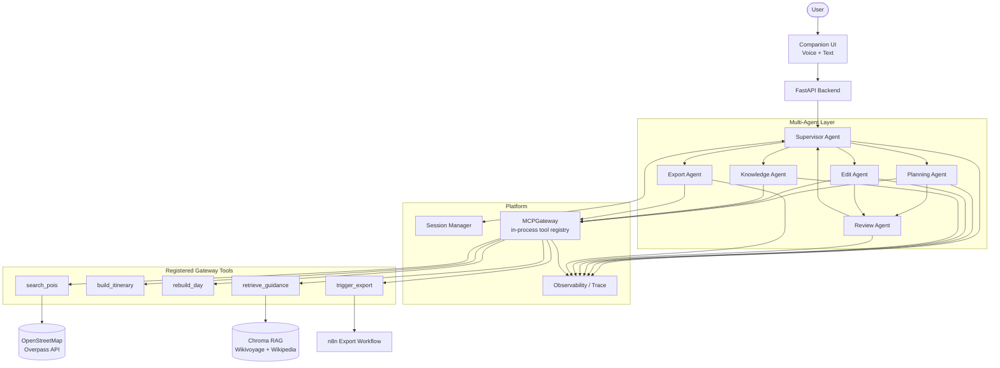

# Voice-First AI Travel Planning Assistant

A voice-first AI travel-planning assistant that accepts voice and text trip requests, extracts travel constraints, searches grounded points of interest (POIs), creates structured day-wise itineraries, retrieves cited travel guidance through RAG, supports itinerary edits, runs automated rule-based evaluations, and exports approved itineraries.

## Contents

- [Key features](#key-features)
- [Architecture](#architecture)
- [End-to-end flow](#end-to-end-flow)
- [Repository structure](#repository-structure)
- [MCP-style Tools Used](#mcp-style-tools-used)
- [Public Datasets and External Sources](#public-datasets-and-external-sources)
- [Setup](#setup)
- [Running AI Evaluations](#running-ai-evaluations)
- [Sample Transcripts](docs/sample-transcripts.md)
- [Deployment](#deployment)
- [Limitations](#limitations)

Additional documentation: [Architecture details](docs/architecture.md) · [Deployment guide](docs/deployment.md) · [Decision log](docs/decision.md)

---

## Key features

Verified against the current implementation:

| Feature | Status |
|---------|--------|
| Speech-to-text input (browser Web Speech API) | Implemented |
| Text input | Implemented |
| Text-to-speech for assistant replies (browser Speech Synthesis) | Implemented |
| Multi-agent orchestration (Supervisor + specialists + Review gate) | Implemented |
| POI search (OpenStreetMap via Overpass, with curated fallback) | Implemented |
| Day-wise itinerary creation | Implemented |
| Practical travel guidance with citations (RAG — Knowledge Agent) | Implemented |
| Itinerary editing with scoped day rebuild | Implemented |
| Rule-based evaluations (Feasibility, Grounding, Edit Correctness, Interest Coverage) | Implemented |
| PDF / Markdown / JSON download (via n8n webhook) | Implemented *(requires n8n)* |
| Email export through n8n | Implemented *(requires n8n + Gmail in workflow)* |
| Deployed frontend and backend | Configuration provided (Render + Vercel); URLs are environment-specific |

**Partially implemented / not active:**

- **Chat LLM:** `LLMAdapter.complete()` is a stub; specialist agents use deterministic Python logic and gateway tools rather than live chat completions.
- **`get_weather`:** Permitted in the gateway permission matrix but **not registered**; Open-Meteo is not integrated.
- **`estimate_travel_time`:** Used internally by the itinerary scheduler and Edit Agent; **not** exposed as a gateway tool.

---

## Architecture

The system is a **multi-agent** travel planner. The **Supervisor Agent** is the only user-facing component. Planning and Edit workflows pass through the **Review Agent** before results reach the user.

| Component | Role |
|-----------|------|
| **Frontend** (`src/ui`) | Vite + React companion UI — chat, voice, itinerary panel, sources, eval status, trace |
| **FastAPI backend** (`src/api`) | HTTP API; all user traffic routes to Supervisor |
| **Supervisor Agent** | Intent classification, slot extraction, clarification, delegation, response synthesis |
| **Planning Agent** | POI resolution + initial itinerary via gateway tools → `PlanArtifact` → Review |
| **Knowledge Agent** | Grounded explanations via `retrieve_guidance` → Supervisor (no Review) |
| **Edit Agent** | Scoped day patches via `rebuild_day` → `EditArtifact` → Review |
| **Review Agent** | Rule-based evals; at most one regeneration; returns `ReviewVerdict` |
| **Export Agent** | Approved-itinerary export via `trigger_export` → Supervisor (no Review) |
| **In-process `MCPGateway`** | Tool registry with per-agent permissions; handlers are Python callables |
| **RAG layer** (`src/rag`) | Wikivoyage + Wikipedia corpus, Chroma vector store, `retrieve_guidance` tool |
| **Evaluation layer** (`src/evals`) | Deterministic eval modules invoked by Review Agent and offline CLI |
| **n8n export workflow** (`workflows/`) | Webhook renders PDF/Markdown/JSON and optional email delivery |

> **MCP implementation note:** This project uses an **in-process MCP-style gateway abstraction**. Tool handlers are registered as Python callables and invoked through `MCPGateway.invoke(...)`. It does **not** use standalone FastMCP servers, stdio MCP transport, or remote MCP protocol servers.



See [docs/architecture.md](docs/architecture.md) for sequence diagrams, message types, and permission matrices.

---

## End-to-end flow

```text
Voice/Text request
→ Supervisor (slot extraction, intent routing)
→ Planning Agent
→ POI Search tool (search_pois)
→ Itinerary Builder tool (build_itinerary)
→ Review Agent evaluations (Feasibility, Grounding, Interest Coverage)
→ User sees approved itinerary

User edit request
→ Supervisor
→ Edit Agent
→ rebuild_day tool
→ Review Agent (Feasibility, Grounding, Edit Correctness)
→ User sees updated itinerary

Explain request
→ Supervisor
→ Knowledge Agent
→ retrieve_guidance (RAG) [+ search_pois when needed]
→ Supervisor → User (with citations)

Export request (approved itinerary only)
→ Supervisor
→ Export Agent
→ trigger_export → n8n webhook
→ PDF download or email
```

---

## Repository structure

```text
src/
├── agents/              # supervisor, planning, knowledge, edit, export, review
├── api/                 # FastAPI entry (Supervisor only)
├── evals/               # feasibility, grounding, edit_correctness, interest_coverage
├── export/              # PDF/Markdown/JSON renderers (used by n8n HTTP workflow)
├── mcp_servers/         # POI search, itinerary builder, export tool handlers
├── platform/
│   ├── mcp_gateway/     # MCPGateway tool registry
│   ├── session/         # Session Manager
│   ├── llm/             # Model-agnostic adapter (chat stub)
│   └── observability/   # Trace spans
├── rag/                 # ingest, embeddings, Chroma, retrieve_guidance
├── shared/              # itinerary models, messages, interests
└── ui/                  # Vite + React companion app

tests/                   # pytest suites (agents, evals, integration, MCP, RAG, API)
workflows/               # n8n export workflow JSON files
docs/                    # architecture, deployment, sample transcripts
data/                    # RAG corpus, embeddings, OSM cache
scripts/                 # Chroma index bootstrap (Docker startup)
```

---

## MCP-style Tools Used

The current project uses an in-process gateway abstraction. Tool handlers are registered as Python callables and invoked through `MCPGateway.invoke(...)`.

**Assignment core orchestration tools:** **POI Search** (`search_pois`) and **Itinerary Builder** (`build_itinerary`).

| Tool | Purpose | Input (summary) | Output (summary) | Invoked by |
|------|---------|-----------------|------------------|------------|
| `search_pois` | Live POI lookup via Overpass (+ session cache, curated fallback on failure) | `city`, `interests`, `max_results`, `session_id` | `pois[]`, `source`, `live_poi_lookup`, `duration_ms` | Planning Agent, Knowledge Agent |
| `build_itinerary` | Schedule POIs into a multi-day itinerary | `city`, `pois`, `total_days`, `traveler_constraints` | `itinerary` (canonical JSON), `source` | Planning Agent |
| `rebuild_day` | Re-schedule a single day; other days unchanged | `itinerary`, `day_number`, `pois`, `traveler_constraints` | `itinerary` (patched) | Edit Agent |
| `retrieve_guidance` | Semantic RAG retrieval for travel guidance | `query`, `city`, `top_k`, `session_id` | `chunks[]`, `citations[]`, `source: rag` | Knowledge Agent |
| `trigger_export` | Delegate file generation to n8n webhook | `itinerary`, `export_format`, `trip_title`, `rag_citations` | `content` (bytes), `filename`, `media_type` | Export Agent |

**Not registered on the gateway:** `estimate_travel_time` (internal scheduler helper), `get_weather` (permission defined but no handler registered).

Registration is in `src/api/deps.py`.

---

## Public Datasets and External Sources

| Source | Purpose | Access method | Grounding metadata |
|--------|---------|---------------|-------------------|
| **OpenStreetMap** (Overpass API) | Live POI names, coordinates, categories | `httpx` → Overpass interpreter URL (+ mirrors) | `osm_id` as `node/`, `way/`, or `relation/` + `source: osm` |
| **Wikivoyage** | RAG travel guidance (Jaipur) | Ingested HTML via `src/rag/ingest.py` | `citation_id`, `source_url`, `section` in RAG citations |
| **Wikipedia** | Supplemental city context for RAG | Same ingestion pipeline | Same citation fields |
| **Curated fallback catalogue** | POIs when live Overpass is unavailable | In-repo `well_known` records in `src/mcp_servers/poi_search/fallback.py` | Synthetic ids `well_known/jaipur-*`, `source: well_known` |

**Not implemented:** Open-Meteo / live weather API.

### How grounding is represented

- **Live OSM POIs** retain Overpass element ids (`node/123456`, `way/…`, `relation/…`) in the itinerary POI registry.
- **RAG guidance** returns normalized citations (`citation_id`, `source_url`, `section`, friendly labels like “Wikivoyage”) surfaced in the Sources panel.
- **Curated fallback** POIs use synthetic `well_known/*` ids and `source: well_known`. The UI shows **“Curated recommendations”** instead of **“Live map data”** when `metadata.live_poi_lookup` is false or only curated counts are present.
- **Uncertainty messaging:** When live lookup is degraded, `itinerary.metadata.user_note` carries a user-facing disclaimer (e.g. live map verification temporarily limited). The trip panel tooltip reinforces this for curated results.

Curated catalogue entries are **not** guaranteed to map to individual public dataset records with per-POI URLs.

### Data limitations

- Overpass can be slow, rate-limited, or temporarily unavailable; mirrors and per-city caching mitigate but do not eliminate outages.
- RAG corpus is currently scoped to **Jaipur** (`src/rag/config.py`).
- Chat completions are stubbed; planning logic is deterministic rather than open-ended LLM generation.
- Email/PDF export requires a running n8n instance and configured webhook URL.

---

## Setup

### Prerequisites

| Requirement | Version / notes |
|-------------|-----------------|
| **Python** | 3.11+ (`requires-python` in `pyproject.toml`; Docker uses `python:3.11`) |
| **Node.js** | 20+ recommended (Vite 7 in `src/ui/package.json`) |
| **npm** | Bundled with Node.js |
| **Git** | For cloning the repository |
| **API keys** | `CHAT_API_KEY` and `EMBEDDING_API_KEY` (OpenAI-compatible) — chat adapter is stubbed but embeddings power RAG retrieval |
| **n8n** *(optional)* | Required only for PDF download and email export |

### Backend setup

```bash
git clone https://github.com/pareenamathur/ai-voice-travel-planner.git
cd ai-voice-travel-planner
python -m venv .venv
```

**Activate the virtual environment:**

```powershell
# Windows PowerShell
.venv\Scripts\Activate.ps1
```

```bash
# macOS / Linux
source .venv/bin/activate
```

**Install dependencies and configure environment:**

```bash
pip install -e ".[dev]"
```

```powershell
# Windows
copy .env.example .env
```

```bash
# macOS / Linux
cp .env.example .env
```

Edit `.env` and set at minimum:

- `CHAT_API_KEY` — OpenAI-compatible chat key (adapter is stubbed; required by settings)
- `EMBEDDING_API_KEY` — embeddings for RAG retrieval

Optional but useful: `OVERPASS_URL`, `OVERPASS_MIRRORS`, `N8N_EXPORT_WEBHOOK_URL`, `CORS_ORIGINS`.

**Start the API:**

```bash
python -m src.api.main
```

- API health: `http://127.0.0.1:8000/health`
- API docs: `http://127.0.0.1:8000/docs`

### Frontend setup

```bash
cd src/ui
npm install
npm run dev
```

- UI: `http://127.0.0.1:5173/` (Vite dev server proxies `/api` and `/health` to port 8000)
- **Production env var** (Vercel): `VITE_API_BASE_URL=https://your-api.onrender.com` (no trailing slash). Not required for local dev.

### n8n export setup

1. Import a workflow from `workflows/`:
   - `workflows/export_itinerary_http.json` — **recommended** for n8n Cloud (calls API render endpoint)
   - `workflows/export_itinerary.json` — self-hosted n8n with shell access
2. For the HTTP workflow, configure in n8n:
   - `API_EXPORT_RENDER_URL` = `https://<api-host>/api/internal/export/render`
   - `EXPORT_RENDER_SECRET` = same value as backend `EXPORT_RENDER_SECRET`
3. Activate the workflow and copy the **Production** webhook URL.
4. Set backend environment variable: `N8N_EXPORT_WEBHOOK_URL=https://<n8n-host>/webhook/export-itinerary`
5. Connect **Gmail credentials** inside the n8n workflow for email delivery.
6. Restart the API after updating `N8N_EXPORT_WEBHOOK_URL`.

See [docs/deployment.md](docs/deployment.md) for full export and email configuration.

### Development commands

```bash
# Backend tests
pytest

# Frontend tests
cd src/ui && npm test

# Lint
ruff check src tests
```

### API endpoints (Supervisor-facing)

| Method | Path | Description |
|--------|------|-------------|
| GET | `/health` | Health check |
| POST | `/api/session/message` | Send user message to Supervisor |
| POST | `/api/session/export` | Download approved itinerary (PDF / Markdown / JSON) |
| POST | `/api/session/export/email` | Email approved itinerary PDF via n8n |
| GET | `/api/session/{session_id}/trace` | Observability spans for session |

---

## Running AI Evaluations

Evaluations are **rule-based**, deterministic, and runnable independently of the UI. The **Review Agent** invokes the same modules at runtime during plan and edit workflows.

### Offline CLI (golden fixtures)

```bash
python -m src.evals.run --suite all
python -m src.evals.run --suite feasibility
python -m src.evals.run --suite grounding
python -m src.evals.run --suite edit_correctness
```

Exit code `0` means every fixture matched its expected pass/fail outcome.

**Sample output** (from `python -m src.evals.run --suite all`):

```text
[OK  ] bad_edit_collateral :: feasibility -> pass (expected pass)
[OK  ] bad_edit_collateral :: grounding -> pass (expected pass)
[OK  ] bad_edit_collateral :: edit_correctness -> fail (expected fail)
        - day 1 changed although edit scope was day 2
[OK  ] fake_osm_id :: feasibility -> pass (expected pass)
[OK  ] fake_osm_id :: grounding -> fail (expected fail)
        - POI id 'fake:amber-fort-9999' does not match any known source format
        - day 1: activity 'Secret Rooftop Palace' references unknown POI 'node/does-not-exist-1234'
[OK  ] golden_3day_relaxed :: feasibility -> pass (expected pass)
[OK  ] golden_3day_relaxed :: grounding -> pass (expected pass)
[OK  ] missing_citation :: feasibility -> pass (expected pass)
[OK  ] missing_citation :: grounding -> fail (expected fail)
        - itinerary has scheduled activities but no POI registry entries or citations
        - live POI lookup was degraded but no user-facing disclaimer (metadata.user_note) is present
[OK  ] overbudget_day :: feasibility -> fail (expected fail)
        - day 1: scheduled 840 min exceeds the 720 min daily window
[OK  ] overbudget_day :: grounding -> pass (expected pass)

11 checks across all suite(s); 11 matched, 0 mismatched.
```

### Focused pytest suites

```bash
python -m pytest tests/evals/test_feasibility.py -q
python -m pytest tests/evals/test_grounding.py -q
python -m pytest tests/evals/test_edit_correctness.py -q
python -m pytest tests/agents/test_review.py -q
```

### What each evaluation checks

| Eval | Applies to | Checks |
|------|------------|--------|
| **Feasibility** | Plan + Edit | Daily duration ≤ 720 min window; per-leg travel ≤ 90 min; daily travel ≤ 240 min; activity count consistent with pace |
| **Grounding** | Plan + Edit | POI ids match known prefixes (`node/`, `way/`, `relation/`, `well_known/`, `llm/`); activities trace to registry; grounding sources present; disclaimer when `live_poi_lookup` is false |
| **Edit Correctness** | Edit only | Scoped day exists; no collateral changes to other days; `city` / `total_days` preserved |
| **Interest Coverage** | Plan only *(Review runtime)* | Requested interests appear in scheduled activities when enforceable POIs exist |

### Current evaluation limitations

- **Grounding** does not verify RAG citations on itinerary tips, does not distinguish curated vs live POI quality beyond id format and disclaimers, and does not detect LLM-hallucinated place names outside the registry.
- **Feasibility** checks activity **count** by pace, not individual activity duration sums beyond the daily budget.
- **Interest Coverage** runs in the Review Agent for plans but is **not** included in the offline `--suite` CLI (only feasibility, grounding, edit_correctness fixtures exist).
- **Edit path grounding** may receive a thinner citation context than plan artifacts depending on artifact payload.

Golden fixtures live in `src/evals/fixtures/`. See also [src/evals/README.md](src/evals/README.md).

---

## Sample Transcripts

Illustrative conversation walkthroughs (planning, clarification, edit, degraded live data, export) are in **[docs/sample-transcripts.md](docs/sample-transcripts.md)**.

---

## Deployment

Production deployment configuration is included in the repository:

| Target | Config | Notes |
|--------|--------|-------|
| **Backend** | `render.yaml`, `Dockerfile` | Render web service; Chroma index built on container start |
| **Frontend** | `src/ui/vercel.json` | Vercel project root directory: `src/ui` |
| **Export** | `workflows/export_itinerary_http.json` | n8n Cloud–friendly HTTP render path |

Full step-by-step instructions: **[docs/deployment.md](docs/deployment.md)**

### Public URLs (fill after deploy)

| Service | URL |
|---------|-----|
| Frontend | `https://<your-project>.vercel.app` |
| Backend | `https://<your-service>.onrender.com` |
| n8n webhook | `https://<your-n8n>/webhook/export-itinerary` |

---

## Limitations

- **Scope:** One-city, 2–4 day itineraries; Jaipur is the primary supported demo city for RAG and curated POIs.
- **Live data:** Overpass availability affects POI grounding; fallback catalogue is used when live search fails.
- **LLM:** Chat adapter is a stub; no open-ended generative planning or editing via LLM completions.
- **Weather:** Rain / weather questions are answered from RAG text only — no live forecast API.
- **Export:** Requires n8n webhook configuration; local dev can run the API without export.
- **MCP:** In-process gateway only — not compatible with external MCP clients without additional wiring.

---

## License / attribution

OpenStreetMap data © OpenStreetMap contributors (ODbL). Wikivoyage and Wikipedia content under Creative Commons licenses. See source URLs in the Sources panel and RAG citations for per-document attribution.
