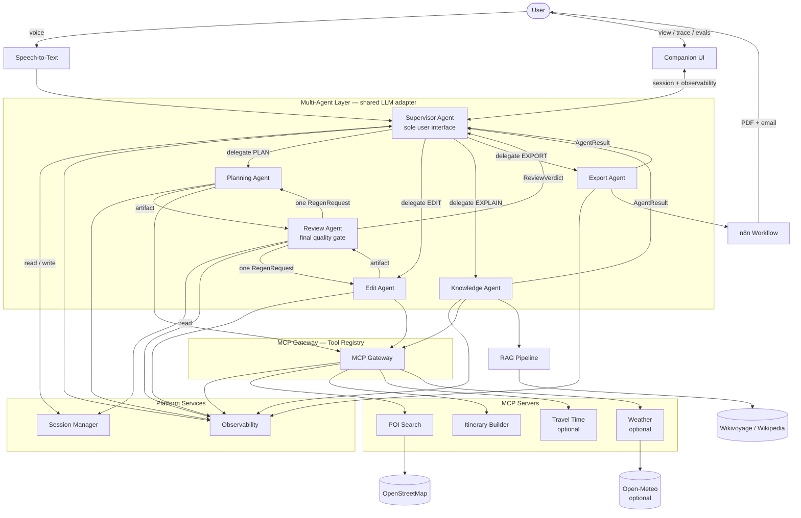
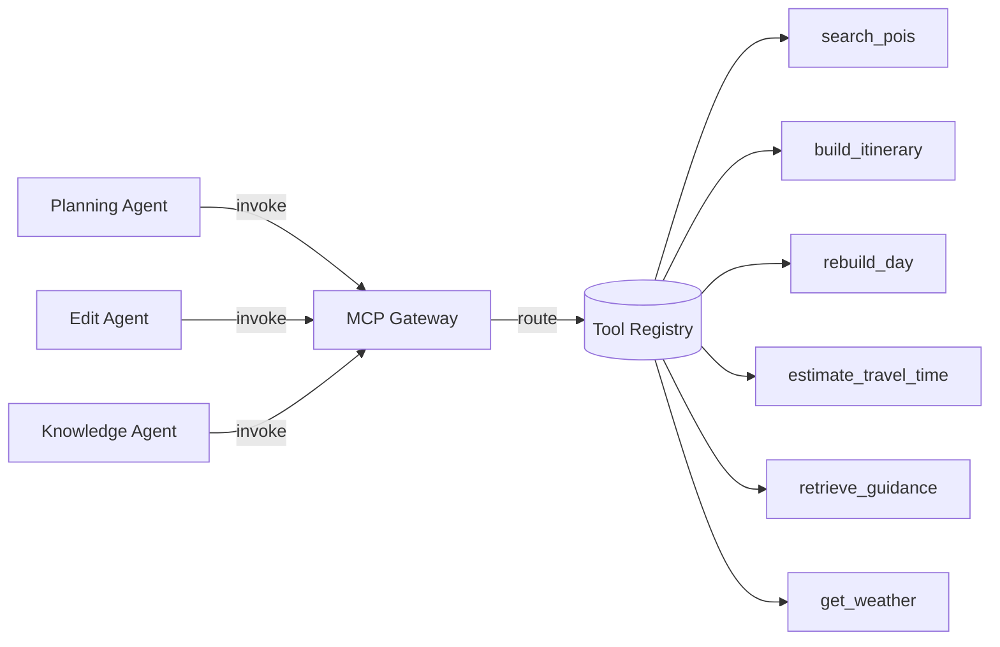
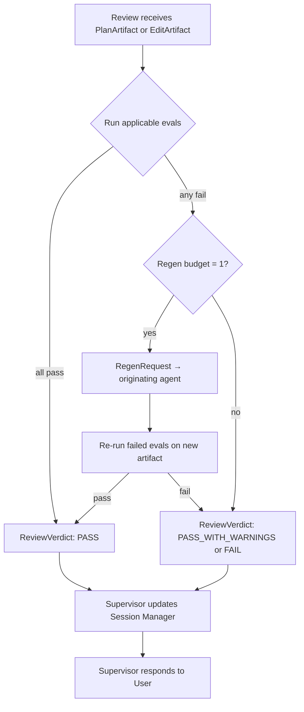
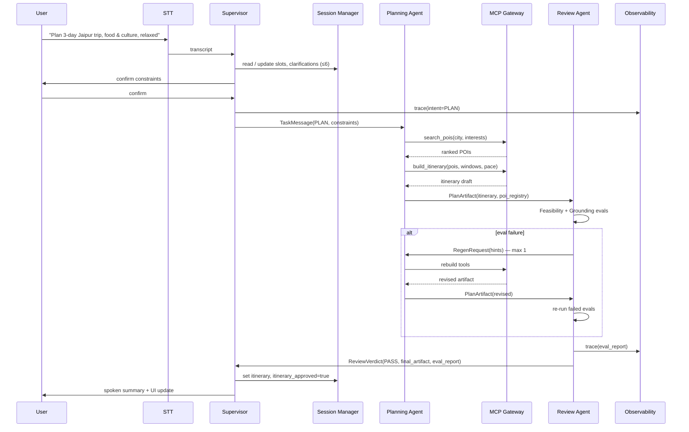
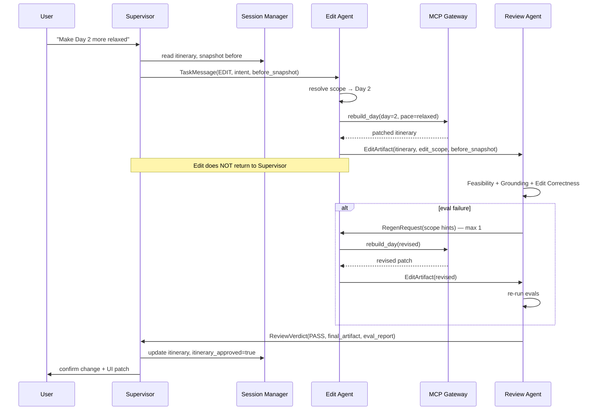
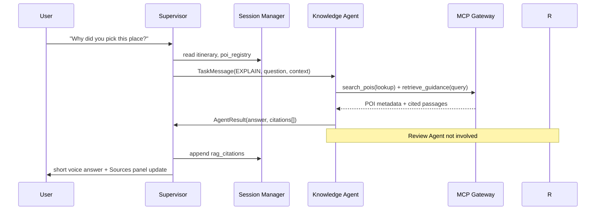
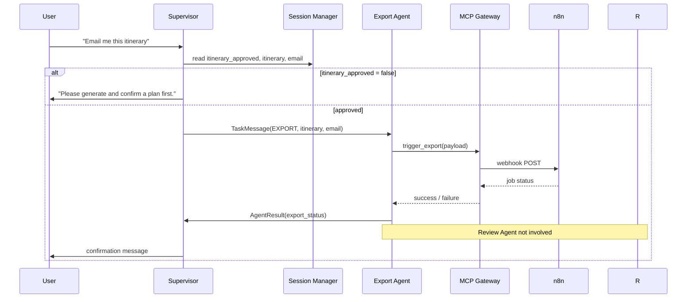

# Architecture — Voice-First AI Travel Planning Assistant

## Overview

A **production-oriented multi-agent** voice travel planner. A **Supervisor Agent** is the **only** component that communicates with the user. Five specialist agents handle planning, knowledge, editing, export, and review — each with a single responsibility, the **same underlying LLM** (different prompts and tool permissions), and **no direct user contact**.

A **Review Agent** is the **final quality gate** for all itinerary generation and editing. Planning and Edit Agents never deliver results to the user; artifacts flow **Planning/Edit → Review → Supervisor → User**.

Infrastructure components — **Session Manager**, **MCP Gateway (Tool Registry)**, and **Observability** — sit alongside the agent layer to keep the system modular, auditable, and model-agnostic.

**Scope:** One city, 2–4 day itineraries, heuristic transit estimates.

---

## Design Principles

| Principle | Implementation |
|-----------|----------------|
| Single user interface | Only Supervisor Agent speaks to the user |
| Review-gated itineraries | Plan and edit workflows must pass Review before reaching Supervisor |
| Single responsibility | Each specialist agent owns one domain |
| One retry max | Review requests at most one regeneration from the originating agent |
| Tool indirection | Specialists call tools only through MCP Gateway |
| Centralized state | Session Manager owns conversation state; Supervisor reads/writes through it |
| Shared LLM, distinct roles | Same model + adapter; per-agent system prompt and tool permissions |
| Model-agnostic | LLM provider swappable via adapter interface |
| Observable by default | Agent traces, tool calls, decisions, and eval results logged and UI-visible |
| Demo clarity | Delegation chain visible for 5-minute walkthrough |

---

## System Context



---

## Layered Architecture

| Layer | Responsibility | Key components |
|-------|----------------|----------------|
| **Presentation** | Voice, itinerary, sources, trace, eval status | Companion UI, STT |
| **Supervision** | User conversation, intent routing, synthesis | Supervisor Agent |
| **Specialists** | Domain work — never user-facing | Planning, Knowledge, Edit, Export, Review |
| **Quality gate** | Eval + retry before itinerary reaches user | Review Agent |
| **Platform** | State, tools, telemetry | Session Manager, MCP Gateway, Observability |
| **LLM** | Shared inference — role via prompt + permissions | LLM adapter (model-agnostic) |
| **Tools** | Deterministic MCP capabilities | POI Search, Itinerary Builder, optional tools |
| **Knowledge** | Grounded corpus | RAG (via Knowledge Agent + Gateway) |
| **Automation** | Approved itinerary export | n8n via Export Agent |

---

## Shared LLM Model

All agents use the **same underlying LLM** through a **model-agnostic adapter**. Agents differ by configuration, not by model instance.

| Agent | System prompt focus | Tool permissions (via Gateway) | Returns to |
|-------|---------------------|-------------------------------|------------|
| **Supervisor** | Intent, clarification (≤6), confirmation, synthesis | None | User |
| **Planning** | POI selection, schedule construction | `search_pois`, `build_itinerary` | Review Agent |
| **Knowledge** | Citation-only explanations | `search_pois`, `retrieve_guidance`, `get_weather` (optional) | Supervisor |
| **Edit** | Scoped patch instructions | `rebuild_day`, `estimate_travel_time` (optional) | Review Agent |
| **Export** | Export validation messaging | `trigger_export` (n8n webhook) | Supervisor |
| **Review** | Eval interpretation, regen hints | None (calls eval modules) | Supervisor |

**Model-agnostic contract:**

```
LLMAdapter.complete(agent_role, messages, tools_allowed[]) → response
```

- Swap providers (OpenAI, Anthropic, etc.) by changing adapter config — no agent code changes.
- Record chosen model in `decision.md` (ADR-003).
- Tool permissions enforced by **MCP Gateway**, not prompt alone.

---

## Platform Services

### Session Manager

Owns all **conversation and itinerary state**. The Supervisor **reads and writes through the Session Manager** — it does not own state directly.

| Responsibility | Detail |
|----------------|--------|
| Session lifecycle | Create, load, expire per `session_id` |
| State storage | `trip_constraints`, `itinerary`, `poi_registry`, `rag_citations`, phase, counters |
| Approval flag | `itinerary_approved` — set `true` only when Review returns `PASS` or `PASS_WITH_WARNINGS` |
| Access control | Supervisor: read/write; Review: read; specialists: payload-only via messages |

**Session fields:**

| Field | Description |
|-------|-------------|
| `trip_constraints` | city, days, interests, pace, party size, mobility |
| `itinerary` | Canonical JSON — days → blocks → stops |
| `poi_registry` | OSM IDs + metadata for recommended stops |
| `rag_citations` | Source IDs for UI Sources panel |
| `clarifying_questions_asked` | Count (max 6) |
| `conversation_phase` | `INTAKE` \| `CONFIRM` \| `ACTIVE` |
| `itinerary_approved` | `true` after Review passes; required for export |
| `last_eval_report` | Most recent Review Agent output |
| `last_review_verdict` | `PASS` \| `PASS_WITH_WARNINGS` \| `FAIL` |

### MCP Gateway (Tool Registry)

Sits **between specialist agents and MCP servers**. Agents **never reference individual MCP tools directly** — they invoke the Gateway, which routes to registered tools based on **agent role permissions**.



| Gateway responsibility | Detail |
|------------------------|--------|
| Tool registry | Maps logical tool names → MCP server endpoints |
| Permission check | Rejects calls not allowed for requesting agent role |
| Request/response logging | Emits structured events to Observability |
| Timeouts & retries | Uniform policy across tools |
| Demo visibility | Every tool call traceable by `correlation_id` |

**Example permission matrix:**

| Tool | Planning | Edit | Knowledge | Supervisor | Review | Export |
|------|----------|------|-----------|------------|--------|--------|
| `search_pois` | ✓ | — | ✓ | — | — | — |
| `build_itinerary` | ✓ | — | — | — | — | — |
| `rebuild_day` | — | ✓ | — | — | — | — |
| `estimate_travel_time` | — | ✓ | — | — | — | — |
| `retrieve_guidance` | — | — | ✓ | — | — | — |
| `get_weather` | — | — | ✓ | — | — | — |
| `trigger_export` | — | — | — | — | — | ✓ |

### Observability

Captures runtime behavior for debugging, demo, and iteration. Data flows to **structured logs** and optionally the **demo UI trace panel**.

| Signal | Content | Emitted by |
|--------|---------|------------|
| **Agent execution trace** | `correlation_id`, agent role, inbound/outbound message types, timestamps | All agents |
| **Tool calls** | Tool name, agent role, input summary, latency, success/fail | MCP Gateway |
| **Decision logs** | Intent classified, delegate chosen, confirm gate, export blocked/allowed | Supervisor |
| **Evaluation results** | Per-eval pass/fail, reasons, regen attempted | Review Agent |

**Trace shape (per user turn):**

```json
{
  "correlation_id": "turn-abc123",
  "session_id": "sess-xyz",
  "spans": [
    { "agent": "supervisor", "event": "intent_classified", "intent": "PLAN" },
    { "agent": "planning", "event": "delegation_started" },
    { "agent": "mcp_gateway", "event": "tool_call", "tool": "search_pois", "latency_ms": 820 },
    { "agent": "planning", "event": "artifact_submitted" },
    { "agent": "review", "event": "eval_completed", "feasibility": "pass", "grounding": "pass" },
    { "agent": "supervisor", "event": "user_response_sent" }
  ]
}
```

---

## Agent Responsibilities

### Supervisor Agent *(sole user interface)*

| Aspect | Detail |
|--------|--------|
| **Owns** | User communication, intent classification, clarifying questions (≤6), constraint confirmation, response synthesis |
| **State** | Reads/writes via Session Manager only |
| **Never does** | MCP/tool calls, eval execution, accept raw Planning/Edit output for user display |
| **Routes to** | Planning, Edit, Knowledge, Export; receives ReviewVerdict from Review |

**Intent routing:**

| Intent | Workflow | Review gate |
|--------|----------|-------------|
| `CLARIFY` / `CONFIRM` | Supervisor ↔ Session Manager ↔ User | No |
| `PLAN` (after confirm) | Supervisor → Planning → **Review** → Supervisor → User | **Yes** |
| `EDIT` | Supervisor → Edit → **Review** → Supervisor → User | **Yes** |
| `EXPLAIN` | Supervisor → Knowledge → Supervisor → User | **No** |
| `EXPORT` | Supervisor → Export → Supervisor → User (only if `itinerary_approved`) | **No** |

**Hard rules:**

- Planning and Edit Agents **never** communicate with the user.
- Supervisor **never** presents an itinerary to the user until Review returns a passing `ReviewVerdict`.
- Export is rejected if `itinerary_approved !== true`.

---

### Planning Agent

| Aspect | Detail |
|--------|--------|
| **Owns** | Initial itinerary creation from confirmed constraints |
| **Tools** | Via Gateway: `search_pois`, `build_itinerary` |
| **Input** | `TaskMessage(PLAN)` from Supervisor (includes session payload) |
| **Output destination** | **Review Agent only** — `PlanArtifact` |
| **Never returns to** | User, Supervisor (directly) |

---

### Edit Agent

| Aspect | Detail |
|--------|--------|
| **Owns** | Scoped itinerary modifications |
| **Tools** | Via Gateway: `rebuild_day`, `estimate_travel_time` (optional) |
| **Input** | `TaskMessage(EDIT)` from Supervisor (includes `before_snapshot`, `edit_intent`) |
| **Output destination** | **Review Agent only** — `EditArtifact` with `edit_scope` |
| **Never returns to** | User, Supervisor (directly) |

**Invariant:** Unchanged days byte-identical after edit.

---

### Knowledge Agent

| Aspect | Detail |
|--------|--------|
| **Owns** | Grounded explanations with citations |
| **Tools** | Via Gateway: `retrieve_guidance`, `search_pois` (metadata), `get_weather` (optional) |
| **Input** | `TaskMessage(EXPLAIN)` from Supervisor |
| **Output destination** | **Supervisor** — `AgentResult` (bypasses Review) |
| **Never returns to** | User directly |

Handles: *"Why this place?"*, *"Is this doable?"*, *"What if it rains?"*

---

### Export Agent

| Aspect | Detail |
|--------|--------|
| **Owns** | PDF/email delivery via n8n |
| **Tools** | Via Gateway: `trigger_export` |
| **Input** | `TaskMessage(EXPORT)` — only when Session Manager reports `itinerary_approved` |
| **Output destination** | **Supervisor** (bypasses Review) |
| **Precondition** | Supervisor verifies approval before delegation |

---

### Review Agent *(final quality gate)*

| Aspect | Detail |
|--------|--------|
| **Owns** | All itinerary quality checks before user sees plan or edit |
| **Receives from** | Planning Agent (`PlanArtifact`), Edit Agent (`EditArtifact`) |
| **Returns to** | **Supervisor only** — `ReviewVerdict` |
| **Never does** | User communication, MCP/tool calls |

**Evaluations:**

| Eval | Plan workflow | Edit workflow |
|------|---------------|---------------|
| **Feasibility** | ✓ | ✓ |
| **Grounding** | ✓ | ✓ |
| **Edit Correctness** | — | ✓ |

**On failure — one regeneration from originating agent:**

| Failed eval | Workflow | Regen target |
|-------------|----------|--------------|
| Feasibility | Plan | Planning Agent |
| Grounding | Plan | Planning Agent |
| Feasibility | Edit | Edit Agent |
| Grounding | Edit | Edit Agent |
| Edit Correctness | Edit | Edit Agent |



- **One regeneration** per plan or edit operation.
- `ReviewVerdict` includes `eval_report`, `final_artifact`, `regen_attempted`.
- On `PASS` / `PASS_WITH_WARNINGS`: Supervisor sets `itinerary_approved = true` and persists artifact via Session Manager.

---

## Workflow Summary

| Workflow | Chain | Review |
|----------|-------|--------|
| **Plan** | User → Supervisor → Planning → **Review** → Supervisor → User | Required |
| **Edit** | User → Supervisor → Edit → **Review** → Supervisor → User | Required |
| **Explain** | User → Supervisor → Knowledge → Supervisor → User | Bypassed |
| **Export** | User → Supervisor → Export → Supervisor → User | Bypassed (pre-approved only) |

---

## Inter-Agent Message Protocol

Specialists and Review communicate via **typed messages** with a shared `correlation_id` for Observability.

| Message | Fields | Direction |
|---------|--------|-----------|
| `TaskMessage` | `task_type`, `session_id`, `payload`, `correlation_id` | Supervisor → Planning, Edit, Knowledge, Export |
| `PlanArtifact` | `itinerary`, `poi_registry`, `rag_citations`, `correlation_id` | Planning → Review |
| `EditArtifact` | `itinerary`, `edit_scope`, `before_snapshot`, `correlation_id` | Edit → Review |
| `RegenRequest` | `failure_reasons[]`, `hints`, `correlation_id` | Review → Planning or Edit |
| `ReviewVerdict` | `status`, `eval_report`, `final_artifact`, `regen_attempted`, `correlation_id` | Review → Supervisor |
| `AgentResult` | `status`, `payload`, `citations[]`, `correlation_id` | Knowledge, Export → Supervisor |

**Removed pattern:** Planning/Edit do **not** send `AgentResult` to Supervisor. Only `ReviewVerdict` carries approved itineraries to Supervisor.

---

## Core Data Flows

### 1. Trip planning (Review-gated)



### 2. Voice edit (Review-gated)



### 3. Explanation (Review bypassed)



### 4. Export (Review bypassed — approved itinerary only)



---

## MCP Tool Contracts

MCP servers sit **behind the Gateway**. Agents invoke logical tool names; the Gateway handles routing.

### `search_pois` → POI Search MCP

```json
{
  "input": {
    "city": "Jaipur",
    "interests": ["food", "culture"],
    "constraints": { "indoor_only": false, "max_results": 30 }
  },
  "output": {
    "pois": [
      {
        "osm_id": "node/123456",
        "name": "City Palace",
        "category": "culture",
        "lat": 26.9855,
        "lon": 75.8513,
        "source": "openstreetmap"
      }
    ]
  }
}
```

### `build_itinerary` / `rebuild_day` → Itinerary Builder MCP

```json
{
  "input": {
    "pois": ["..."],
    "days": 3,
    "daily_window": { "start": "09:00", "end": "21:00" },
    "pace": "relaxed"
  },
  "output": {
    "days": [
      {
        "day": 1,
        "blocks": {
          "morning": { "stop": {}, "duration_min": 120, "travel_min": 15 },
          "afternoon": {},
          "evening": {}
        }
      }
    ]
  }
}
```

### `retrieve_guidance` → RAG Pipeline

Returns chunked passages with `citation_id`, `source_url`, `section`.

### Optional tools

| Tool | Permitted agent | Purpose |
|------|-----------------|---------|
| `estimate_travel_time` | Edit | Recalculate legs on "reduce travel time" |
| `get_weather` | Knowledge | Indoor alternatives for rain questions |

---

## RAG Architecture

Accessed by Knowledge Agent through Gateway (`retrieve_guidance`). Planning Agent does not generate uncited tips.

| Component | Choice (initial) | Notes |
|-----------|------------------|-------|
| Source corpus | Wikivoyage + linked Wikipedia | One city scoped |
| Chunking | Section-aware | Preserve citation boundaries |
| Embedding | Provider API | Record in `decision.md` |
| Vector store | Chroma or equivalent | Reproducible |
| Retrieval | Top-k + city metadata filter | |
| Generation | Citation-only prompt | No facts without retrieved context |

---

## Companion UI (Minimal)

```
┌──────────────────────────────────────────────────────────────────┐
│  [Mic]  Live transcript: "Plan a 3-day trip..."                 │
├─────────────────────────────┬────────────────────────────────────┤
│  Itinerary                  │  Sources / References              │
│  Day 1                      │  [1] Wikivoyage — Jaipur           │
│    Morning — City Palace    │  [2] OSM node/123456               │
│  Day 2 ...                  │                                    │
├─────────────────────────────┴────────────────────────────────────┤
│  Review: Feasibility ✓  Grounding ✓  Edit Correctness —          │
├──────────────────────────────────────────────────────────────────┤
│  Trace: Supervisor → Planning → Review → Supervisor → User       │
│  Tools: search_pois (820ms) · build_itinerary (340ms)           │
└──────────────────────────────────────────────────────────────────┘
```

---

## Evaluation Architecture

Eval modules live in `src/evals/`. **Only Review Agent** runs them at runtime. CLI (`npm run eval`) uses the same modules offline.

| Eval | Trigger | Checks |
|------|---------|--------|
| **Feasibility** | Plan + edit | Daily duration ≤ window; travel ≤ threshold; pace consistency |
| **Grounding** | Plan + edit | Valid `osm_id`; citations present; disclaimers when data missing |
| **Edit Correctness** | Edit only | Scope match; no collateral changes; constraints preserved |

---

## n8n Workflow

Invoked by Export Agent through Gateway (`trigger_export`). Review is not in the export path — Supervisor enforces `itinerary_approved` beforehand.

---

## Repository Layout (Target)

```
/
├── docs/
│   ├── architecture.md
│   ├── implementation-plan.md
│   ├── decision.md
│   └── phases/
├── src/
│   ├── agents/
│   │   ├── supervisor/       # user interface, intent, synthesis
│   │   ├── planning/         # itinerary creation → Review
│   │   ├── knowledge/        # explanations → Supervisor
│   │   ├── edit/             # scoped patches → Review
│   │   ├── export/           # n8n trigger → Supervisor
│   │   └── review/           # eval gate → Supervisor
│   ├── platform/
│   │   ├── session/          # Session Manager
│   │   ├── mcp-gateway/      # Tool Registry, permissions, routing
│   │   ├── llm/              # model-agnostic adapter + per-agent config
│   │   └── observability/    # trace, log, metrics emitters
│   ├── shared/
│   │   └── messages/         # typed inter-agent contracts
│   ├── mcp-servers/          # POI Search, Itinerary Builder, optional
│   ├── rag/                  # ingest, index (behind retrieve_guidance)
│   ├── evals/                # feasibility, grounding, edit_correctness
│   ├── api/                  # HTTP/WebSocket → Supervisor only
│   └── ui/                   # companion + trace panel
├── data/
├── scripts/
├── workflows/
└── tests/
    ├── agents/
    ├── platform/
    └── evals/
```

---

## 5-Minute Demo Narrative

| Minute | Show | Talking point |
|--------|------|---------------|
| 0–1 | Architecture diagram | "Supervisor is the only voice; Planning and Edit must pass Review before you see anything." |
| 1–2 | Plan + trace panel | Confirm → Planning → Gateway tool calls → Review evals → Supervisor |
| 2–3 | Edit + evals | Edit patches Day 2; Review runs Edit Correctness; no direct Edit → User path |
| 3–4 | Explain | Knowledge answers with citations; Review not in path |
| 4–5 | Export + observability | Only approved itinerary exports; trace + eval report in UI |

---

## Non-Functional Requirements

| Concern | Target |
|---------|--------|
| Latency (plan incl. review) | < 35s for 3-day plan |
| Clarifying questions | ≤ 6 (Supervisor via Session Manager) |
| Review gate | 100% of plan/edit flows pass Review before user sees result |
| Retry budget | 1 regeneration per plan/edit (Review enforced) |
| Export guard | Blocked unless `itinerary_approved` |
| Model swap | Change adapter config only — no agent rewrites |
| Deployment | Public HTTPS URL |

---

## Security & Privacy

- Only Supervisor receives user transcripts
- Session Manager enforces access boundaries per agent role
- Gateway rejects unauthorized tool calls
- Email collected only for export; export requires approved itinerary
- Sanitize transcripts in Observability logs

---

## Related Documents

- [Implementation Plan](./implementation-plan.md)
- [Decision Log](./decision.md)
- [Phase Evaluations](./phases/)
