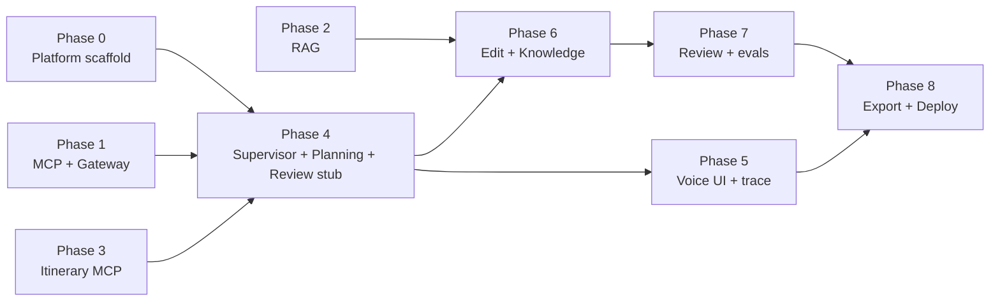

# Phase-Wise Implementation Plan

Build the multi-agent voice travel planner incrementally. The **Supervisor Agent** is the sole user-facing entry point. **Planning and Edit Agents return artifacts to the Review Agent only** — never directly to the Supervisor or user. Platform services (**Session Manager**, **MCP Gateway**, **Observability**) are introduced early and hardened across phases.

**Reference city for MVP:** Jaipur (2–4 days).

---

## Phase Summary

| Phase | Name | Outcome | Eval doc |
|-------|------|---------|----------|
| 0 | Foundation | Repo, agents, platform scaffold, shared LLM adapter | [phase-00-foundation/eval.md](./phases/phase-00-foundation/eval.md) |
| 1 | MCP & Data Layer | MCP servers registered in Tool Registry | [phase-01-mcp-data/eval.md](./phases/phase-01-mcp-data/eval.md) |
| 2 | RAG & Grounding | `retrieve_guidance` behind Gateway | [phase-02-rag/eval.md](./phases/phase-02-rag/eval.md) |
| 3 | Itinerary Builder MCP | `build_itinerary`, `rebuild_day` in registry | [phase-03-itinerary-mcp/eval.md](./phases/phase-03-itinerary-mcp/eval.md) |
| 4 | Supervisor + Planning + Review stub | Review-gated plan flow; Session Manager wired | [phase-04-agent/eval.md](./phases/phase-04-agent/eval.md) |
| 5 | Voice & Companion UI | STT, itinerary, sources, trace panel | [phase-05-voice-ui/eval.md](./phases/phase-05-voice-ui/eval.md) |
| 6 | Edit + Knowledge Agents | Review-gated edits; explain bypasses Review | [phase-06-editing/eval.md](./phases/phase-06-editing/eval.md) |
| 7 | Review Agent + Evaluations | Full eval gate, one retry, observability | [phase-07-evals/eval.md](./phases/phase-07-evals/eval.md) |
| 8 | Export Agent + Deploy | Approved-only export, n8n, public URL | [phase-08-deploy/eval.md](./phases/phase-08-deploy/eval.md) |

---

## Agent Build Order

---

## Phase 0 — Foundation

**Goal:** Multi-agent + platform scaffold with shared LLM adapter and message contracts.

### Tasks

- [ ] Initialize git repo, `.gitignore`, `.env.example`
- [ ] Choose stack and LLM provider (record in `decision.md`)
- [ ] Folder structure per [architecture.md](./architecture.md)
- [ ] **LLM adapter** (model-agnostic) + per-agent config stubs (prompt, permissions)
- [ ] Message types: `TaskMessage`, `PlanArtifact`, `EditArtifact`, `ReviewVerdict`, `AgentResult`, `RegenRequest`
- [ ] **Session Manager** stub (in-memory store)
- [ ] **MCP Gateway** stub (registry + permission check skeleton)
- [ ] **Observability** stub (correlation_id, span logger)
- [ ] Agent registry; API routes **only** to Supervisor
- [ ] Health-check + README stub

### Deliverables

- Runnable health-check
- Platform + agent module stubs with responsibility docstrings

### Dependencies

None.

---

## Phase 1 — MCP & Data Layer + Gateway Registration

**Goal:** POI Search MCP registered in Gateway; agents invoke `search_pois` through Gateway only.

### Tasks

- [ ] Overpass API client + POI normalization
- [ ] POI Search MCP server
- [ ] Register `search_pois` in MCP Gateway with Planning + Knowledge permissions
- [ ] Gateway logs tool calls to Observability
- [ ] Cache OSM responses under `data/`
- [ ] Unit tests: Overpass client, Gateway permission rejection for unauthorized roles

### Deliverables

- `search_pois` callable via Gateway only (≥20 Jaipur POIs)

### Dependencies

Phase 0.

---

## Phase 2 — RAG & Grounding

**Goal:** `retrieve_guidance` tool behind Gateway for Knowledge Agent.

### Tasks

- [ ] Ingest Wikivoyage Jaipur + linked Wikipedia
- [ ] Section-aware chunking with citation metadata
- [ ] RAG retrieve API wrapped as Gateway tool `retrieve_guidance`
- [ ] Permission: Knowledge Agent only
- [ ] Freeze corpus snapshot

### Deliverables

- 5 sample retrieval queries with citations via Gateway

### Dependencies

Phase 0. Can parallel with Phase 1.

---

## Phase 3 — Itinerary Builder MCP

**Goal:** `build_itinerary` and `rebuild_day` registered in Gateway.

### Tasks

- [ ] Canonical itinerary JSON schema
- [ ] Scheduling heuristic + travel time estimates
- [ ] Itinerary Builder MCP server
- [ ] Register `build_itinerary` (Planning) and `rebuild_day` (Edit) in Gateway
- [ ] Schema validation tests

### Deliverables

- 3-day sample itinerary via Gateway tool calls

### Dependencies

Phase 1.

---

## Phase 4 — Supervisor + Planning Agent + Review Stub

**Goal:** Review-gated planning workflow. Planning → Review → Supervisor → User.

### Tasks

#### Session Manager

- [ ] Full session schema: constraints, itinerary, `itinerary_approved`, eval report
- [ ] Supervisor reads/writes **only** through Session Manager

#### Supervisor Agent

- [ ] Intent: `CLARIFY`, `CONFIRM`, `PLAN`
- [ ] Slot extraction; max 6 clarifying questions via Session Manager counter
- [ ] Confirm gate before delegating `PLAN`
- [ ] Delegate `PLAN` to Planning; **wait for ReviewVerdict** (not Planning output)
- [ ] On `ReviewVerdict(PASS)`: persist artifact, set `itinerary_approved`, respond to user
- [ ] Emit decision logs to Observability

#### Planning Agent

- [ ] Accept `TaskMessage(PLAN)` from Supervisor
- [ ] Invoke `search_pois` + `build_itinerary` **via Gateway only**
- [ ] Submit `PlanArtifact` to **Review Agent** — not to Supervisor

#### Review Agent (stub)

- [ ] Passthrough: accept `PlanArtifact`, return `ReviewVerdict(PASS)` without evals
- [ ] Enforce Planning → Review → Supervisor chain in wiring

#### Observability

- [ ] Log agent spans for plan workflow
- [ ] Log Gateway tool calls with `correlation_id`

### Deliverables

- Text E2E: user → confirm → plan via **Planning → Review → Supervisor**
- Sample transcript in `docs/sample-transcripts/`
- Trace log showing full chain

### Dependencies

Phases 1, 2, 3.

---

## Phase 5 — Voice & Companion UI

**Goal:** STT + UI connected to Supervisor; trace and eval panels.

### Tasks

- [x] STT integration
- [ ] Microphone + live transcript
- [x] Itinerary view (day/block, duration, travel time)
- [x] Sources panel
- [x] **Agent trace panel** (spans from Observability)
- [x] **Eval status panel** (from `last_eval_report` via Session Manager)
- [x] UI → Supervisor API only

### Deliverables

- Voice planning E2E with visible trace: Supervisor → Planning → Review → Supervisor

### Dependencies

Phase 4.

---

## Phase 6 — Edit Agent + Knowledge Agent

**Goal:** Review-gated edits; explanations bypass Review.

### Tasks

#### Edit Agent

- [x] Parse `edit_intent`; resolve scope
- [x] Call `rebuild_day` via Gateway
- [x] Submit `EditArtifact` to **Review Agent** — not to Supervisor
- [ ] Optional `estimate_travel_time` via Gateway

#### Knowledge Agent

- [x] Handle `EXPLAIN` via Gateway (`retrieve_guidance`, `search_pois`, optional `get_weather`)
- [x] Return `AgentResult` to **Supervisor** — Review bypassed

#### Supervisor updates

- [x] Route `EDIT`: delegate Edit → wait ReviewVerdict → update Session Manager → user
- [x] Route `EXPLAIN`: delegate Knowledge → user (no Review)
- [x] Verify Planning/Edit never appear in trace as direct responders to user

#### Review stub

- [x] Accept `EditArtifact`; passthrough `ReviewVerdict(PASS)`

### Deliverables

- 4 edit scenarios (Review-gated chain)
- 3 explanation scenarios (Knowledge → Supervisor)
- Transcripts in `docs/sample-transcripts/`

### Dependencies

Phases 4, 5.

---

## Phase 7 — Review Agent + Evaluations + Observability

**Goal:** Full quality gate with three evals, one retry, eval results in logs and UI.

### Tasks

#### Eval modules (`src/evals/`)

- [x] Feasibility, Grounding, Edit Correctness
- [x] CLI: `python -m src.evals.run --suite all`
- [x] ≥5 golden fixtures

#### Review Agent (full)

- [ ] Replace stub: run evals on `PlanArtifact` and `EditArtifact`
- [ ] On failure: one `RegenRequest` to **originating agent** (Planning or Edit)
- [ ] Re-run failed evals; return `ReviewVerdict` with `eval_report`
- [ ] Emit eval results to Observability

#### Supervisor + Session Manager

- [ ] Set `itinerary_approved` only on PASS / PASS_WITH_WARNINGS
- [ ] On FAIL: do not approve; Supervisor explains to user

#### UI

- [ ] Eval panel shows per-eval pass/fail from `last_eval_report`

### Deliverables

- Review blocks bad artifacts or passes after one retry
- Eval CLI + live eval visibility in demo
- Fail → regen → pass documented

### Dependencies

Phases 4, 6.

---

## Phase 8 — Export Agent + Deployment

**Goal:** Export bypasses Review; only `itinerary_approved` itineraries export.

### Tasks

#### Export Agent

- [ ] `trigger_export` registered in Gateway (Export Agent only)
- [ ] Accept `TaskMessage(EXPORT)`; POST to n8n via Gateway
- [ ] Return `AgentResult` to Supervisor

#### Supervisor

- [ ] Route `EXPORT` only when `itinerary_approved === true`
- [ ] Reject export with user message if not approved

#### Deployment

- [ ] n8n workflow in `workflows/`
- [ ] Public HTTPS deploy
- [ ] README: multi-agent architecture, Gateway, Session Manager, Observability, eval commands
- [ ] 5-minute demo script

### Deliverables

- Public URL
- Export blocked for unapproved itineraries (test case)
- Submission-ready repo

### Dependencies

Phases 5, 7.

---

## Cross-Phase Practices

| Practice | When |
|----------|------|
| Update `decision.md` | Non-obvious tech or product choices |
| Run phase `eval.md` | Before marking phase complete |
| Gateway-only tool access | Never call MCP servers directly from agents |
| Session via Session Manager | Supervisor never holds state in local variables |
| One agent = one folder | Single responsibility per agent |
| Same LLM adapter | All agents; differ by prompt + Gateway permissions |

---

## Milestone Timeline (Suggested)

| Week | Phases | Focus |
|------|--------|-------|
| 1 | 0, 1, 2, 3 | Platform scaffold, MCP + Gateway, RAG, Itinerary |
| 2 | 4, 5 | Review-gated plan, Voice UI + trace |
| 3 | 6, 7 | Edit + Knowledge, full Review + evals |
| 4 | 8 | Export guard, deploy, demo |

---

## Related Documents

- [Architecture](./architecture.md)
- [Decision Log](./decision.md)
- Phase evaluations: [phases/](./phases/)
